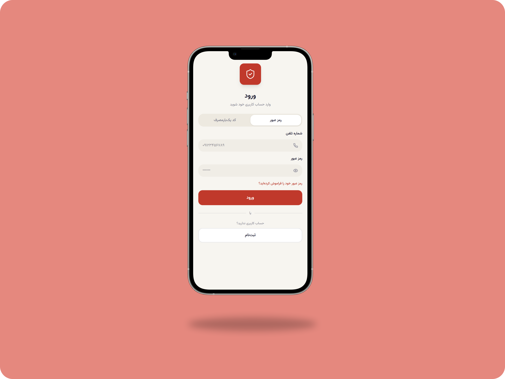
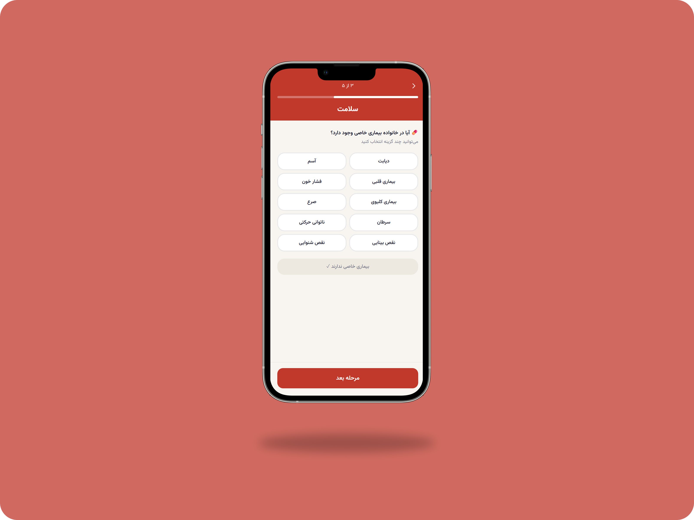
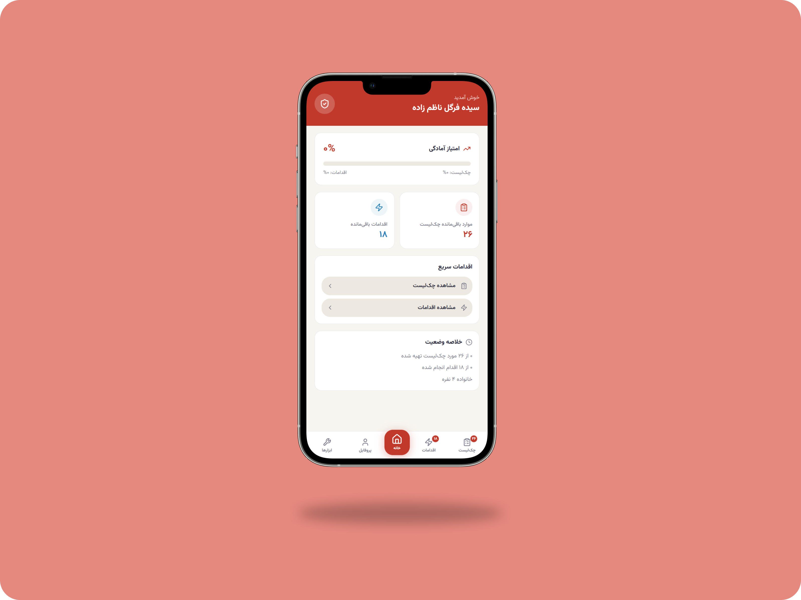
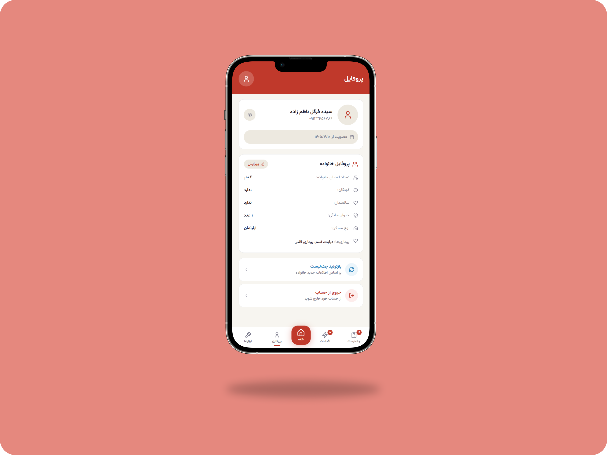
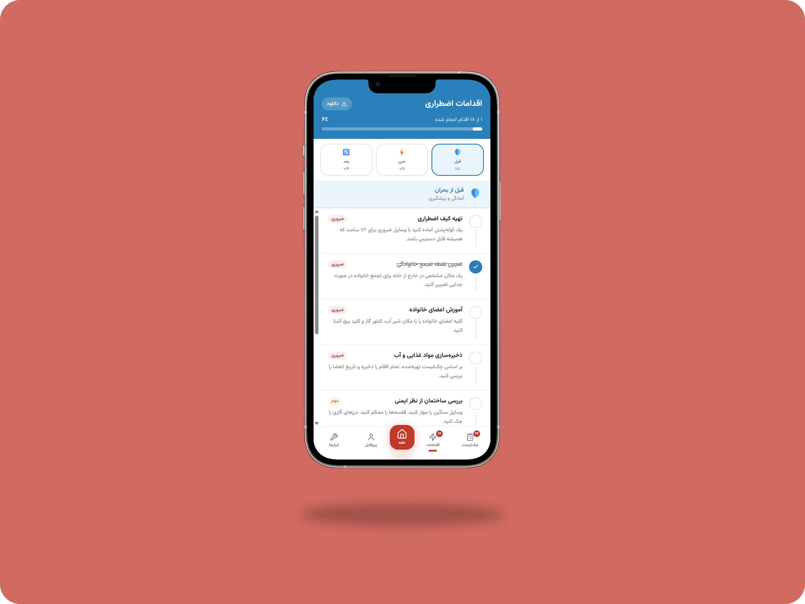
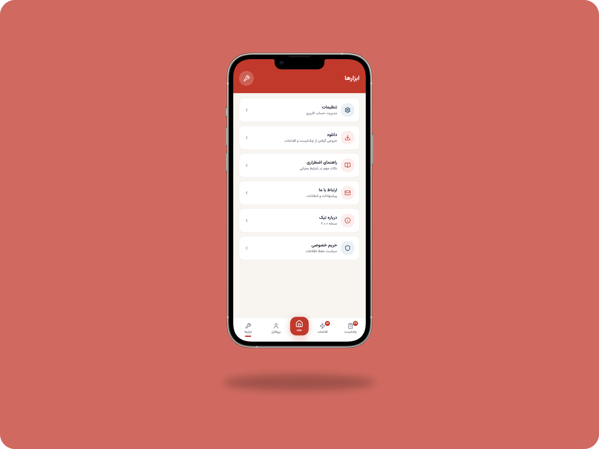

# 📋 Tik - Smart Emergency Preparedness System

A personalized crisis preparedness platform designed to help families prepare for emergency situations by generating customized checklists and action plans based on their specific needs.

---

## 📌 Project Overview

Tik is a full-stack web application that helps individuals and families prepare for emergency situations through personalized planning and secure profile management.

The system allows users to create an account, build a household profile, and securely store their preparedness information.

The system collects information about household members and special conditions, such as:

* 👶🏻 Children
* 👵🏻 Elderly family members
* 🐱 Pets
* 💊 Medical conditions
* 🏠 Residence conditions

Based on each household's characteristics, Tik automatically generates personalized emergency resources.

The platform currently provides:

- ✅ Personalized emergency supply checklists
- ⚡ Before, during, and after crisis action plans
- 👤 Secure user accounts and profile management
- 📊 Readiness dashboard
- 📄 Multi-format exports
- 💾 Persistent data storage
- 🔐 Authentication and secure access

The current version focuses on **war-related emergency preparedness**,helping families organize supplies and understand essential actions during critical situations.

Tik is designed with a scalable architecture that enables continuous expansion through new crisis scenarios, advanced emergency management features, and future service integrations.

---

## ✨ Features

### 👨‍👩‍👧‍👦 Personalized Household Assessment
Build a customized emergency preparedness profile based on your family's unique situation, including:

- Number of family members
- Children and infants
- Elderly family members
- People with disabilities
- Chronic medical conditions
- Medication requirements
- Pets and animal care needs

This ensures that every recommendation is tailored specifically to your household.

---

### 📋 Smart Emergency Checklists
Automatically generate personalized emergency supply checklists based on the information provided by the user.

Generated checklists include:

- Food and water supplies
- Medical and first-aid equipment
- Personal hygiene products
- Infant and child necessities
- Elderly care items
- Pet supplies
- Important documents
- Communication and power backup equipment

Each item can be tracked and marked as completed to monitor preparedness progress.

---

### 🚨 Crisis Action Guidance
Receive structured recommendations for every phase of a crisis situation:

#### 🛡️ Before a Crisis
- Family preparedness planning
- Emergency contact organization
- Shelter identification
- Resource preparation

#### ⚡ During a Crisis
- Immediate safety actions
- Communication procedures
- Shelter protocols
- Family coordination guidelines

#### 🔄 After a Crisis
- Damage assessment
- Family accountability checks
- Access to emergency resources
- Recovery and stabilization recommendations

---

### 🔐 Secure Authentication

Secure authentication ensures that each user's emergency data remains private and accessible only to authorized users. Household information, preparedness plans, and generated checklists are safely managed through a protected account system.

- User registration
- Secure login
- JWT-based authentication
- Password hashing using bcrypt
- Persistent user sessions

---

### 💾 Persistent Data Storage

User information, household profiles, generated checklists, and emergency plans are securely stored in a local SQLite database through the backend API.

---

### 📊 Progress Tracking
Monitor preparedness progress in real time:

- Track completed checklist items
- View remaining tasks
- Measure overall readiness level
- Maintain organized preparation plans

---

### 👤 Household Profile Management

Users can securely manage their household profile.

Profile includes:

- Family members
- Children
- Elderly
- Medical conditions
- Pets
- Emergency information

---

### 📄 Multi-Format Export System
Generated emergency plans can be exported in multiple formats:

- 📄 TXT for quick printing and sharing
- 🗂️ JSON for data portability and integration
- 🌐 HTML for visually formatted reports

This makes emergency information accessible both online and offline.

---

### 📱 Mobile-First Experience
Designed primarily for smartphones while remaining fully usable on desktop devices.

Features include:

- Responsive layouts
- Touch-friendly interactions
- Fast navigation
- App-like user experience

---

### 🎨 Modern User Interface
Built with modern frontend technologies to provide:

- Smooth page transitions
- Interactive components
- Clean visual hierarchy
- Accessible user experience
- Fast and responsive interactions

---

## 📱 Application Preview

### 🔐 Login

Secure authentication system with user registration and login, providing safe access to personalized emergency preparedness data.



---

### 📝 Questionnaire

A guided multi-step assessment that collects household information to generate personalized emergency plans.



---

### 🏠 Home Dashboard

A centralized dashboard that provides quick access to preparedness status, emergency resources, and the application's main features.



---

### 👤 Profile

Manage household information, review personal details, and update preparedness data at any time.



---

### ✅ Emergency Checklist

Customized supplies and preparedness items generated based on household needs.


---

### 🚨 Action Plans

Personalized guidance covering essential actions before, during, and after emergency situations.



---

### 🧰 Tools

Access useful emergency utilities, preparedness resources, and supporting tools designed to improve household readiness.



---

## 🗂️ Project Structure

```text
Tik/
│
├── server/
│
├── src/
│   │
│   ├── app/
│   │   ├── components/
│   │   ├── api.ts
│   │   └── App.tsx
│   │
│   ├── styles/
│   └── main.tsx
│ 
├── screenshots/
│   └── mockups/
│
├── index.html
├── package-lock.json
├── package.json
├── postcss.config.mjs
├── vite.config.ts
└── README.md
```

---

## 🏗️ System Architecture

Tik follows a modern full-stack architecture that separates the presentation layer, business logic, and data storage. This modular design improves maintainability, scalability, and makes future feature development significantly easier.

<div align="center">

    User
    │
    ▼
    ┌────────────────────────────────┐
    │      React + TypeScript UI     │
    │        (Frontend - Vite)       │
    └────────────────────────────────┘
    │
    RESTful API (JSON)
    │
    ▼
    ┌────────────────────────────────┐
    │        Express.js Server       │
    │      Authentication & APIs     │
    └────────────────────────────────┘
    │
    ▼
    ┌────────────────────────────────┐
    │         SQLite Database        │
    │  Users • Profiles • Checklists │
    │    Actions • Emergency Data    │
    └────────────────────────────────┘

</div>

### Architecture Highlights

- ⚛️ **React + TypeScript** powers a responsive, mobile-first user interface.
- 🔌 **RESTful APIs** enable communication between the frontend and backend using JSON.
- ⚙️ **Express.js** handles business logic, authentication, and data processing.
- 🔐 **JWT Authentication** secures user sessions, while **bcryptjs** protects user passwords.
- 🗄️ **SQLite** stores user accounts, household profiles, generated checklists, emergency plans, and application data.
- 📦 The modular architecture makes it easy to extend the platform with new emergency scenarios, cloud synchronization, notifications, and additional services in future releases.

---

## 🛠️ Technologies

### ⚙️ Backend

- Node.js
- Express.js
- SQLite
- better-sqlite3
- jsonwebtoken
- bcryptjs

### 💻 Frontend

- React
- TypeScript
- Vite
- Tailwind CSS

### 🔌 APIs

- RESTful API
- JSON-based communication

### 🎨 UI & Animation

- Motion
- Lucide React
- Sonner

### 🧰 Utilities

- React Hook Form
- Date-fns
- Recharts
- Class Variance Authority
- Tailwind Merge

---

## 🚀 Installation

### 1. Clone the repository

```bash
git clone https://github.com/Fargolnz/Tik.git
```

### 2. Enter project directory

```bash
cd Tik
```

### 3. Install dependencies

```bash
npm install
```
---

## ▶️ Running the Application

You can start the application using either of the following methods.

### Option 1 — Run Frontend & Backend Together (Recommended)

Start both the Express backend and the React frontend with a single command:

```bash
npm run dev:all
```

---

### Option 2 — Run Services Separately

#### Start the backend server

```bash
npm run server
```

#### Open a second terminal and start the frontend

```bash
npm run dev
```

---

### Open the application

Once the development servers are running, open:

```text
http://localhost:5173
```

The frontend will automatically communicate with the Express backend running in the background.

---

## 📦 Build for Production

```bash
npm run build
```
The production-ready frontend files will be generated inside:

```bash
dist/
```

---

## 🔮 Planned Features

### ☁️ Cloud Synchronization

Keep preparedness data available across multiple devices through secure cloud storage.

Planned capabilities:

- Automatic data synchronization
- Cloud backup & recovery
- Multi-device access
- Secure online storage

---

### 👨‍👩‍👧 Advanced Household Management

Expand profile capabilities beyond a single questionnaire.

Future improvements:

- Multiple household profiles
- Family member management
- Medical information tracking
- Emergency contact management
- Caregiver and dependent support

---

### 🛡️ War Preparedness Expansion

Introduce advanced preparedness tools specifically designed for conflict and wartime scenarios.

Planned features include:

- Shelter and safe-room planning
- Emergency evacuation planning
- Family reunification procedures
- Safe-route recommendations
- Emergency communication plans
- Essential document protection guidance
- Supply duration estimation
- Location-based preparedness recommendations

---

### 📦 Emergency Inventory Management

Allow users to maintain a digital inventory of emergency supplies.

Future capabilities:

- Track owned emergency items
- Monitor quantities
- Record expiration dates
- Receive replenishment reminders

---

### 📍 Nearby Emergency Resources

Help users identify critical services during emergencies.

Potential integrations:

- Hospitals
- Pharmacies
- Emergency shelters
- Humanitarian aid centers
- Relief distribution points

---

### 🚨 Smart Alerts & Notifications

Keep users informed and prepared.

Planned notifications:

- Checklist completion reminders
- Medication renewal reminders
- Emergency preparedness updates
- Supply expiration alerts
- Family safety review reminders

---

### 🤖 Intelligent Recommendation Engine

Use household data to provide smarter preparedness suggestions.

Future versions may offer:

- Dynamic risk assessment
- Personalized emergency planning
- Resource prioritization
- Family-specific recommendations
- Adaptive preparedness scoring

---

### 🌍 Multi-Crisis Support

Although Tik currently focuses on wartime preparedness, future versions may support additional crisis scenarios:

- 🌎 Earthquakes
- 🌊 Floods
- 🔥 Fires
- 🌪️ Severe weather events
- ⚠️ Infrastructure disruptions
- 🔌 Long-term power outages
- ☣️ Hazardous material incidents

Each scenario will provide specialized checklists and action plans.

---

## 🎯 Project Goals

The main objective of Tik is to improve family preparedness by:

* Reducing panic during emergencies
* Providing personalized recommendations
* Organizing essential supplies
* Increasing awareness of emergency procedures
* Helping families create practical preparedness plans
* Personalized household profiles
* Long-term preparedness management

---

## 🎓 Academic Project

This project is being developed as part of a IT Project Management course.

The project follows an iterative development process where new features are continuously planned, implemented, tested, and evaluated.

Current development focuses on:

- Full-stack architecture
- Authentication
- Database integration
- REST API development
- User profile management
- Scalable system architecture

---

## 🤝🏻 Acknowledgments

- IT Project Management Course
- Faculty of Farabi, University of Tehran
- Academic Year 1404–1405