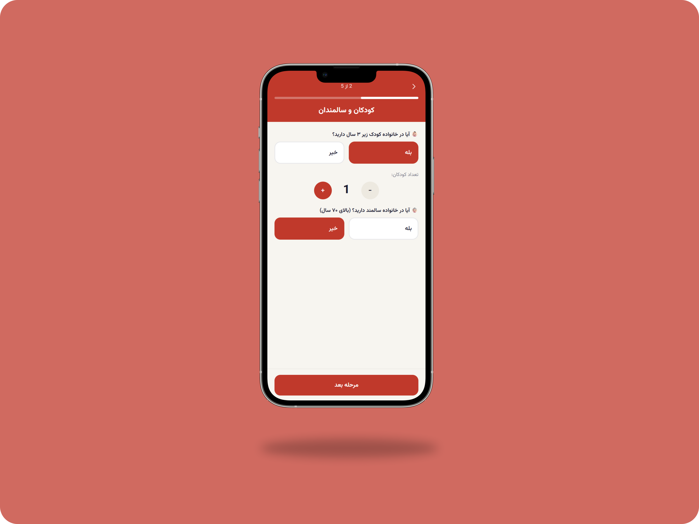
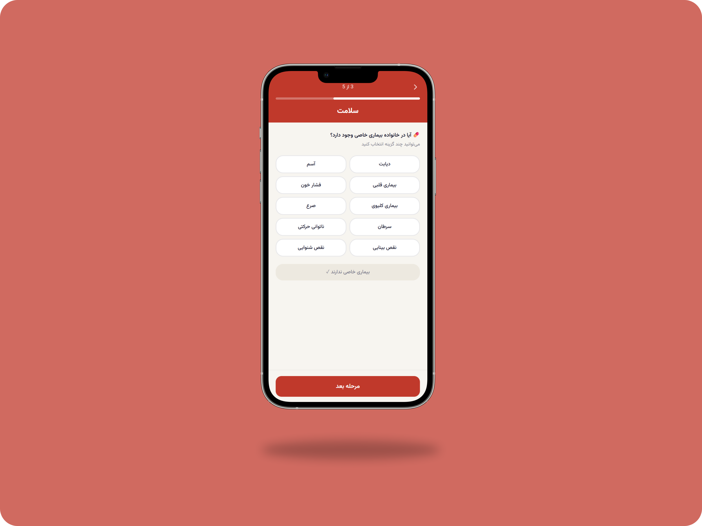
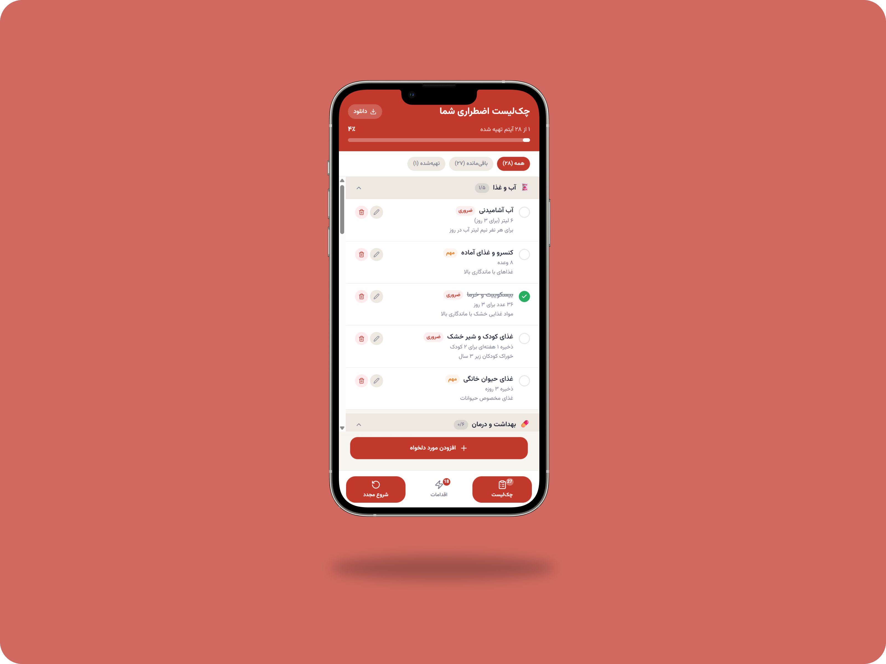
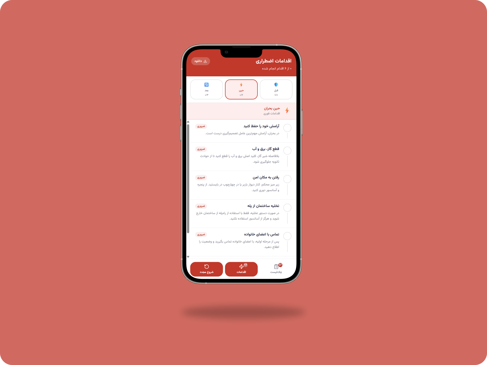
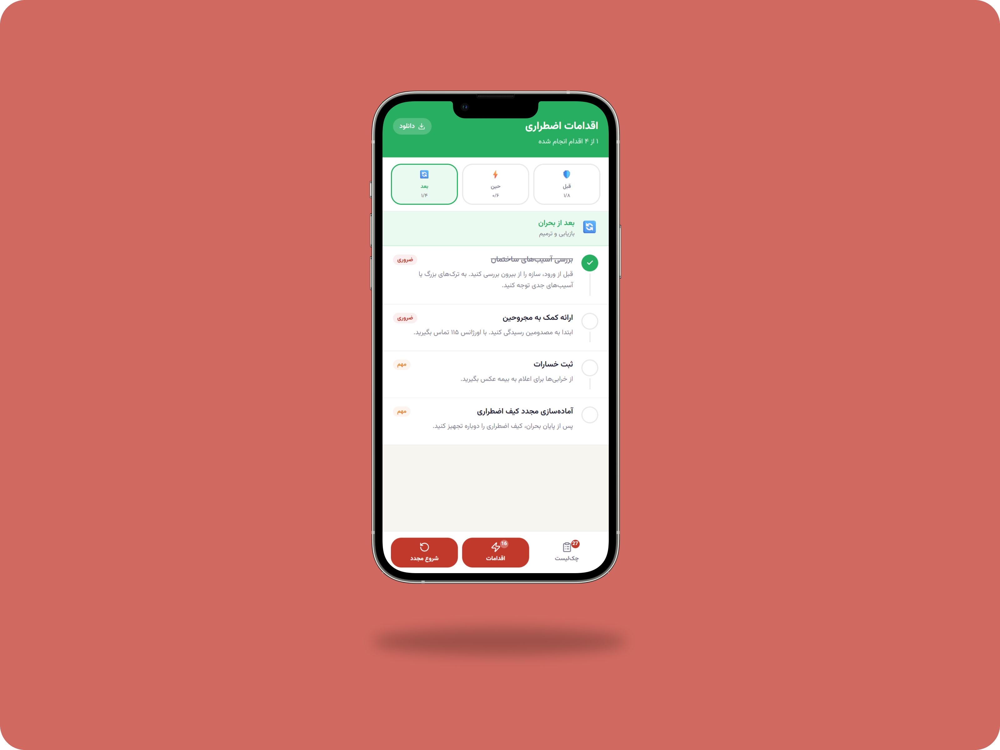

# 📋 Tik - Smart Emergency Preparedness System

A personalized crisis preparedness platform designed to help families prepare for emergency situations by generating customized checklists and action plans based on their specific needs.

---

## 📌 Project Overview

Tik is a web-based application that helps individuals and families prepare for emergency situations through personalized planning.

The system collects information about household members and special conditions, such as:

* 👶🏻 Children
* 👵🏻 Elderly family members
* 🐱 Pets
* 💊 Medical conditions
* ♿ Special care requirements

Based on this information, Tik automatically generates:

* ✅ Personalized emergency supply checklists
* 📋 Family-specific preparedness plans
* ⚡ Critical actions before, during, and after a crisis
* 🎯 Priority-based emergency recommendations

The current version focuses on **war-related emergency preparedness**, helping families organize supplies and understand essential actions during critical situations.

---

## ✨ Features

### 👨‍👩‍👧‍👦 Personalized Household Assessment
Build a customized emergency preparedness profile based on your family's unique situation, including:

- Number of family members
- Children and infants
- Elderly family members
- People with disabilities
- Chronic medical conditions
- Medication requirements
- Pets and animal care needs

This ensures that every recommendation is tailored specifically to your household.

---

### 📋 Smart Emergency Checklists
Automatically generate personalized emergency supply checklists based on the information provided by the user.

Generated checklists include:

- Food and water supplies
- Medical and first-aid equipment
- Personal hygiene products
- Infant and child necessities
- Elderly care items
- Pet supplies
- Important documents
- Communication and power backup equipment

Each item can be tracked and marked as completed to monitor preparedness progress.

---

### ⚡ Crisis Action Guidance
Receive structured recommendations for every phase of a crisis situation:

#### 🛡️ Before a Crisis
- Family preparedness planning
- Emergency contact organization
- Shelter identification
- Resource preparation

#### 🚨 During a Crisis
- Immediate safety actions
- Communication procedures
- Shelter protocols
- Family coordination guidelines

#### 🌱 After a Crisis
- Damage assessment
- Family accountability checks
- Access to emergency resources
- Recovery and stabilization recommendations

---

### 🎯 Family-Oriented Recommendations
Unlike generic preparedness guides, Tik adapts recommendations according to:

- Family composition
- Health conditions
- Vulnerable members
- Special care requirements

This allows users to focus only on relevant preparations.

---

### 📊 Progress Tracking
Monitor preparedness progress in real time:

- Track completed checklist items
- View remaining tasks
- Measure overall readiness level
- Maintain organized preparation plans

---

### 📄 Multi-Format Export System
Generated emergency plans can be exported in multiple formats:

- 📄 TXT for quick printing and sharing
- 🗂️ JSON for data portability and integration
- 🌐 HTML for visually formatted reports

This makes emergency information accessible both online and offline.

---

### 📱 Mobile-First Experience
Designed primarily for smartphones while remaining fully usable on desktop devices.

Features include:

- Responsive layouts
- Touch-friendly interactions
- Fast navigation
- App-like user experience

---

### 🎨 Modern User Interface
Built with modern frontend technologies to provide:

- Smooth page transitions
- Interactive components
- Clean visual hierarchy
- Accessible user experience
- Fast and responsive interactions

---

## 📱 Application Preview

### 👨‍👩‍👧‍👦 Questionnaire – Step 2
Family Information & Household Assessment



---

### 💊 Questionnaire – Step 3
Medical Conditions & Special Care Requirements



---

### ✅ Personalized Emergency Checklist

Customized supplies and preparedness items generated based on household needs.



---

### 🛡️ Before-Crisis Action Plan
Essential preparations and preventive measures to improve readiness.


---

### 🚨 During-Crisis Action Plan
Critical actions and safety procedures during emergency situations.



---

### 🌱 After-Crisis Action Plan
Recovery guidance and post-crisis stabilization recommendations.



---

## 🗂️ Project Structure

```text
Tik/
│
├── src/
│   │
│   ├── app/
│   │   ├── components/
│   │   │   ├── SplashScreen.tsx
│   │   │   ├── Questionnaire.tsx
│   │   │   ├── ChecklistView.tsx
│   │   │   ├── ActionsView.tsx
│   │   │   ├── DownloadModal.tsx
│   │   │   └── data.ts
│   │   │
│   │   └── App.tsx
│   │
│   ├── styles/
│   └── main.tsx
│ 
├── screenshots/
│   └── mockups/
│
├── index.html
├── package-lock.json
├── package.json
├── postcss.config.mjs
├── vite.config.ts
└── README.md
```

---

## 🛠️ Technologies

### Frontend

* React
* TypeScript
* Vite
* Tailwind CSS

### UI & Animation

* Motion
* Lucide React
* Sonner

### Utilities

* React Hook Form
* Date-fns
* Recharts
* Class Variance Authority
* Tailwind Merge

---

## 🚀 Installation

### 1. Clone the repository

```bash
git clone https://github.com/Fargolnz/Tik.git
```

### 2. Enter project directory

```bash
cd Tik
```

### 3. Install dependencies

```bash
npm install
```

### 4. Start development server

```bash
npm run dev
```

### 5. Open browser

```text
http://localhost:5173
```

---

## 📦 Build for Production

```bash
npm run build
```
The production-ready files will be generated inside:

```bash
dist/
```

---

## 🔮 Planned Features

### 🔐 Authentication & User Accounts
Enable users to create secure accounts and access their emergency plans from any device.

Planned capabilities:

- User registration
- Login & logout
- Password recovery
- Secure sessions
- Profile synchronization

---

### ☁️ Cloud Storage & Synchronization
Store emergency data safely in the cloud.

Features under consideration:

- Checklist synchronization
- Automatic backup
- Multi-device access
- Secure data storage

Users will never lose their preparedness information.

---

### 👨‍👩‍👧 Advanced Household Management
Expand profile capabilities beyond a single questionnaire.

Future improvements:

- Multiple household profiles
- Family member management
- Medical information tracking
- Emergency contact management
- Caregiver and dependent support

---

### 🛡️ War Preparedness Expansion
Introduce advanced preparedness tools specifically designed for conflict and wartime scenarios.

Planned features include:

- Shelter and safe-room planning
- Emergency evacuation planning
- Family reunification procedures
- Safe-route recommendations
- Emergency communication plans
- Essential document protection guidance
- Supply duration estimation
- Location-based preparedness recommendations

---

### 📍 Nearby Emergency Resources
Help users identify critical services during emergencies.

Potential integrations:

- Hospitals
- Pharmacies
- Emergency shelters
- Humanitarian aid centers
- Relief distribution points

---

### 🚨 Smart Alerts & Notifications
Keep users informed and prepared.

Planned notifications:

- Checklist completion reminders
- Medication renewal reminders
- Emergency preparedness updates
- Supply expiration alerts
- Family safety review reminders

---

### 🌐 Offline Emergency Mode
Ensure access to critical information even when internet connectivity is unavailable.

Planned capabilities:

- Offline checklist access
- Cached emergency instructions
- Downloadable preparedness guides
- Offline household information

---

### 🤖 Intelligent Recommendation Engine
Use household data to provide smarter preparedness suggestions.

Future versions may offer:

- Dynamic risk assessment
- Personalized emergency planning
- Resource prioritization
- Family-specific recommendations
- Adaptive preparedness scoring

---

### 🌍 Multi-Crisis Support
Although Tik currently focuses on wartime preparedness, future versions may support additional crisis scenarios:

- 🌎 Earthquakes
- 🌊 Floods
- 🔥 Fires
- 🌪️ Severe weather events
- ⚠️ Infrastructure disruptions
- 🔌 Long-term power outages

Each scenario will provide specialized checklists and action plans.

---

## 🎯 Project Goals

The main objective of Tik is to improve family preparedness by:

* Reducing panic during emergencies
* Providing personalized recommendations
* Organizing essential supplies
* Increasing awareness of emergency procedures
* Helping families create practical preparedness plans

---

## 🎓 Academic Project

This project is being developed as part of a IT Project Management course.

The project follows an iterative development process where new features are continuously planned, implemented, tested, and evaluated.

Current development focuses on:

* Requirement analysis
* User-centered design
* MVP development
* Incremental feature implementation
* Future scalability

---

## 🤝🏻 Acknowledgments

- IT Project Management Course
- Faculty of Farabi, University of Tehran
- Academic Year 1404–1405